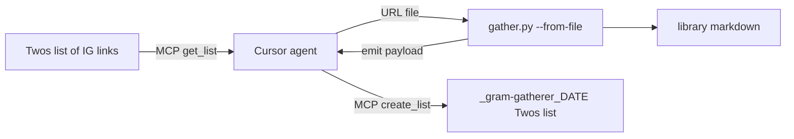
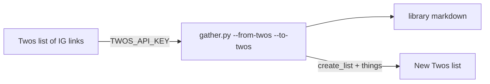
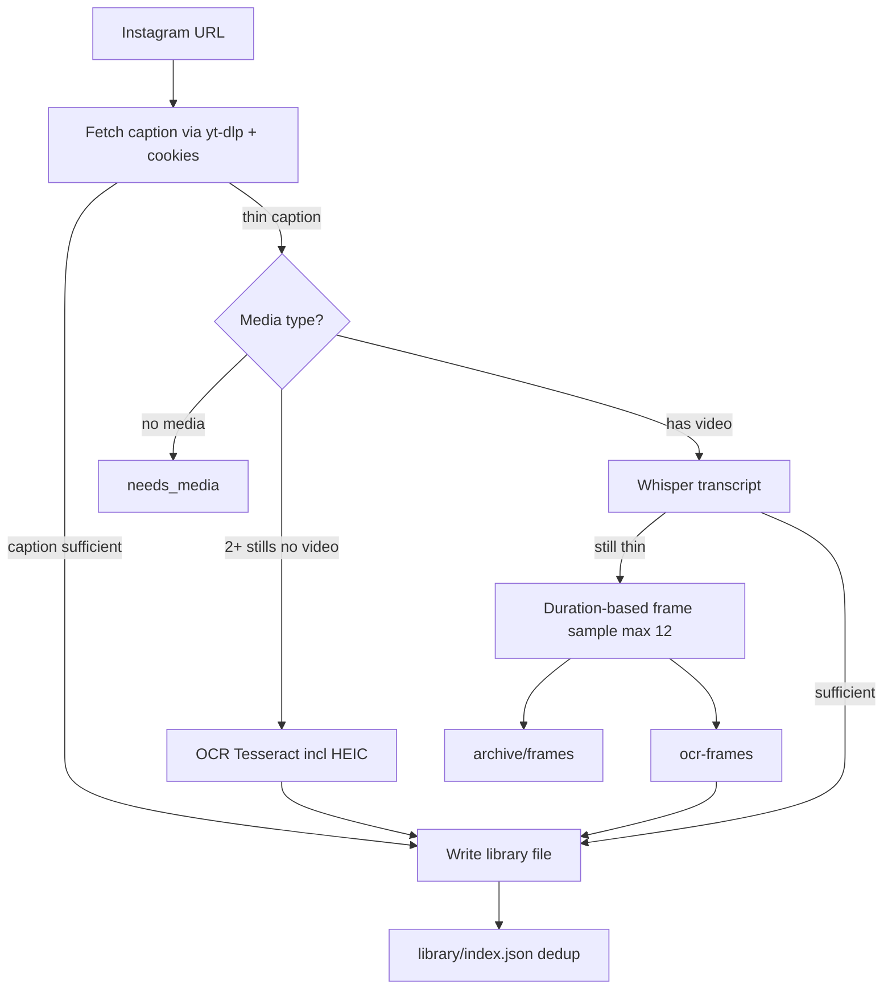

# gram-gatherer

Paste Instagram post/reel URLs (or drain a Twos list). A Python CLI extracts recipes, books, albums, workouts, and other items into searchable markdown under `library/`. Twos can be the capture inbox and the place extracted text lands again — either via Cursor’s Twos MCP or the Twos REST API.

## What’s working now (Sep 2026)

- **Twos MCP path:** read a Twos list → `--from-file` batch gather → create a dated Twos list (e.g. `_gram-gatherer_YYYY-MM-DD`) with visible titles
- **Twos REST path:** `--from-twos` / `--to-twos` with `TWOS_API_KEY` for headless drain + write-back
- **Caption-first extract:** if the caption already has the list, skip media
- **Carousel OCR only:** Tesseract runs only on **2+ stills with no video** (not reel thumbnails)
- **HEIC/HEIF slides:** Instagram carousel thumbs in `.heic` are treated as images (`pillow-heif`)
- **Reels → Whisper:** audio transcription when caption is thin
- **Silent reel frame OCR:** if Whisper is still thin, sample up to 12 frames by duration, OCR them, archive JPEGs under `archive/frames/`
- **Cookies:** on this machine, **Opera** works best (`--cookies-from-browser opera`). The browser cookie database is copied once per run into `cache/cookies.txt`; later posts in that run reuse the file. Close Opera briefly if that first copy fails.

## Workflow diagram

### End-to-end (Twos MCP)



### End-to-end (Twos REST)



### Extract pipeline (inside gather)



Silent on-screen text reels use **frame OCR** after Whisper. Sampled frames are archived under `archive/frames/<shortcode>/` while we calibrate sampling accuracy.

## Use it from chat

### Single URL

```bash
py -3 scripts/gather.py "https://www.instagram.com/reel/SHORTCODE/" --cookies-from-browser opera
```

If Instagram blocks the download, paste the caption and/or drop media:

```bash
py -3 scripts/gather.py "URL" --caption "pasted caption" --media "path/to/video.mp4"
```

### Twos MCP path (preferred when Twos MCP is connected)

1. Agent reads the Twos list via MCP and writes Instagram URLs to a file.
2. CLI drains the file into `library/`.
3. Agent creates a new Twos list (name like `_gram-gatherer_2026-09-29`) with titles as visible bullets.

```bash
py -3 scripts/gather.py --from-file cache/twos-mcp-urls.txt --cookies-from-browser opera --emit-twos-payload \
  --twos-source-title "Saved Instagram" \
  --twos-output-title "_gram-gatherer_2026-09-29"
```

Skills: `gram-gatherer` (single URL), `gram-gatherer-twos-mcp` (Twos in/out). Path chooser: [docs/PATHS.md](docs/PATHS.md).

### Twos REST path (automation)

Headless drain with `TWOS_API_KEY` (Twos → Settings → Advanced → API Keys; needs `read:lists`, `write:lists`, `write:things`):

```bash
export TWOS_API_KEY=twos_...
py -3 scripts/gather.py --from-twos "Saved Instagram" --to-twos
```

Optional: `--to-twos-list "My gathered books"` names the new output list (implies `--to-twos`). Default title is `Gathered from <source> — YYYY-MM-DD`.

Each successful save still writes `library/...`. It also creates a Twos thing on the new list: title line, Instagram `url`, and the markdown body as the thing’s long-form `note`. `--from-twos` alone drains into the library without write-back.

## Layout

- `library/recipes/`, `library/books/`, `library/albums/`, `library/workouts/`, `library/other/` — one markdown file per item
- `library/index.json` — shortcode → file path (dedup)
- `cache/` — temporary downloads; `cache/<shortcode>/` is deleted after a successful save. `cache/cookies.txt` stays for the rest of the run (gitignored)
- `archive/frames/` — sampled reel frames for OCR accuracy review (gitignored)
- `scripts/gather.py` — CLI (single URL, `--from-file`, or `--from-twos`)
- `scripts/adapters/url.py` / `file.py` / `twos.py` — inputs
- `scripts/lib/twos_client.py` / `twos_out.py` — Twos REST + write-back
- `scripts/lib/extract.py` — caption → carousel OCR → Whisper → frame OCR
- `docs/PATHS.md` — paste / MCP / REST / file / phone
- `docs/ERROR-LOG.md` — fetch and needs_media problems, including a save that still carried a yt-dlp error

## Setup

```bash
py -3 -m pip install -r requirements.txt
```

Also install [Tesseract OCR](https://github.com/UB-Mannheim/tesseract/wiki) on Windows (e.g. winget `UB-Mannheim.TesseractOCR`) so carousel OCR works.

For Workflow 1 REST, also export `TWOS_API_KEY`.

Instagram cookies (pick the browser where you’re logged in):

```bash
py -3 scripts/gather.py "URL" --cookies-from-browser opera
```

`chrome`, `edge`, and `firefox` work when their cookie DB is readable. `GRAM_COOKIES_FROM_BROWSER` also works.

### Optional: OCR and Whisper

| Step | When it runs |
|---|---|
| Caption | One yt-dlp metadata call. If the caption already has the list → write and stop. No second metadata call |
| OCR | Thin caption and the metadata says image carousel: slide thumbnails only (no video download), including `.heic` |
| Whisper | Thin caption and the metadata says video: one download, then transcribe. The CPU model stays loaded for the rest of the run (`int8`) |
| Frame OCR | After Whisper, if text is still thin: sample up to 12 frames by duration, OCR them (`ocr-frames`). Stills are copied to `archive/frames/<shortcode>/` (gitignored) for sampling accuracy review; `cache/` still clears after save |

- **OCR:** Tesseract on PATH + `pillow`, `pytesseract`, `pillow-heif`
- **Whisper (local):** `faster-whisper` + `ffmpeg`
- **Whisper (API):** `openai` + `OPENAI_API_KEY`

## CLI exit codes

| Code | JSON `status` | Meaning |
|---:|---|---|
| 0 | `saved` | Wrote `library/<type>/{shortcode}-{slug}.md` |
| 2 | `duplicate` | Shortcode already in `library/index.json` (use `--overwrite` to replace) |
| 3 | `needs_media` | Paste caption and/or drop media, then re-run |
| 1 | `error` | Bad URL or write failure |

## Later

- Phone Shortcut / inbox file drain — see `scripts/adapters/inbox.py`
- Tune or prune `archive/frames/` once frame-sampling accuracy looks good
