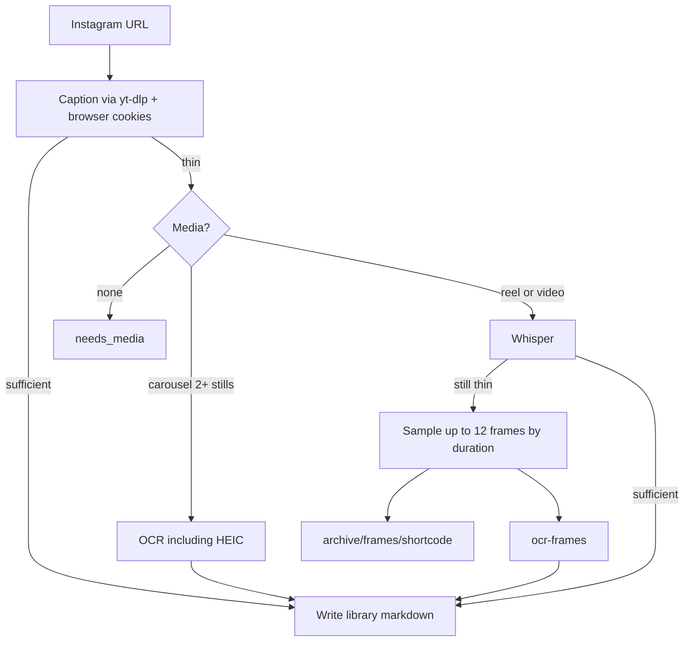

# Path triage — how to get Instagram saves into the library (and Twos)

Same extract pipeline (`scripts/gather.py` → `library/`). Different **shells** for where URLs come from and whether Twos is involved.

## Quick chooser

| Situation | Path | Twos auth |
|---|---|---|
| Paste one or a few IG links in chat | **A. Chat paste** | None |
| Twos MCP connected; interactive drain + write-back | **B. Twos MCP** | Cursor MCP |
| Large backlog / cron / no Cursor in the loop | **C. Twos REST** | `TWOS_API_KEY` |
| Agent or Shortcut already has a URL list file | **D. URL file** | None (optional MCP write-back later) |
| Phone capture (Shortcut → inbox or Twos) | **E. iOS capture** | None for inbox file; Twos app/MCP/REST for Twos |

Redundancy is intentional: B and C both do “Twos in + library + Twos out.” Use B when MCP is handy; C when you need headless automation.

## Extract pipeline (shared by A–D)



Silent on-screen reels use frame OCR after Whisper. Sampled JPEGs are archived under `archive/frames/` for accuracy review (not cleared with `cache/`).

## A — Chat paste

1. User pastes Instagram URL(s).
2. Agent runs `python scripts/gather.py "URL"` (sequentially if several).
3. Library only, unless the agent also uses Twos MCP to write things by hand.

**Skill:** `gram-gatherer`

## B — Twos MCP (Cursor-orchestrated)

1. Agent uses Twos MCP `get_list` / `list_lists`.
2. Writes URLs to `cache/twos-mcp-urls.txt`.
3. `python scripts/gather.py --from-file cache/twos-mcp-urls.txt --emit-twos-payload`
4. Agent calls Twos MCP `create_list` + `create_thing(s)` from `twos_mcp_writeback`.

**Skill:** `gram-gatherer-twos-mcp`  
**Needs:** Twos MCP enabled in this Cursor session (desktop or cloud with MCP configured).

## C — Twos REST (CLI automation)

1. `export TWOS_API_KEY=twos_…`
2. `python scripts/gather.py --from-twos "List name" --to-twos`

Python owns both Twos read and write. No MCP required. Shared URL extraction lives in `scripts/lib/instagram_urls.py` (used by file + Twos adapters).

## D — URL file

```bash
python scripts/gather.py --from-file path/to/urls.txt
python scripts/gather.py --from-file path/to/urls.txt --emit-twos-payload
```

One Instagram URL per line; `#` comments allowed; optional `url | media_path`.

Used as the handoff format for path B. Fine on its own for any backlog sitting in a text file.

## E — iOS capture (Workflow 2)

Phone only **queues** links. Extract runs later on a machine with yt-dlp/cookies.

**Inbox file (Shortcut → `inbox.txt`):**

1. iOS Shortcut appends the shared Instagram URL to `inbox.txt` (repo root or iCloud copy). See [IOS.md](IOS.md).
2. On the gather machine:

```bash
python scripts/gather.py --from-inbox --cookies-from-browser opera
```

Saved/duplicate lines are removed from the inbox; `needs_media` / `error` stay. Use `--keep-inbox` to skip rewrite. Optional `--emit-twos-payload` for MCP write-back after drain.

**Twos list:** share into Twos (app or Shortcut → Twos), then drain with path **B** or **C**.

Cursor on iPhone can direct agents; it does not run `gather.py` on-device.

## Shared core

- `lib/instagram_urls.py` — URL extraction (file + Twos REST adapters)
- `adapters/inbox.py` / `lib/batch_inbox.py` — Shortcut inbox drain + prune
- `lib/twos_payload.py` — thing shape for MCP write-back payloads
- `lib/twos_out.py` — REST create_list / create_thing write-back

Do not run B and C on the same list at the same time (duplicate library writes are skipped by shortcode; Twos write-back could double-create things).
